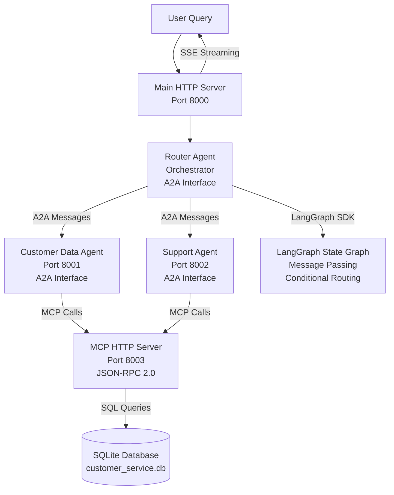

# Multi-Agent Customer Service System

### MCP-Powered • A2A Protocol • LangGraph SDK • Independent Agents • SQLite-Grounded

This project implements a fully functional **multi-agent customer service platform** built for Assignment 5 - Multiagentic systems and MCP.

It combines **Agent-to-Agent (A2A) communication**, **Model Context Protocol (MCP)**, **LangGraph SDK orchestration**, **independent agent services**, and **database-backed tools** via SQLite.

---

## Project Overview

This system simulates an intelligent customer service workflow. Three specialized agents collaborate to:

- Understand and route customer queries
- Retrieve and update customer data via MCP
- Handle support requests and ticket management
- Coordinate multi-step workflows
- Provide natural-language responses
- Demonstrate true agent independence with A2A interfaces

The pipeline is **grounded in a real SQLite database** via an MCP HTTP Server, orchestrated by **LangGraph SDK** for A2A coordination, and demonstrates **independent agent services** with proper A2A interfaces.

---

## Project Structure

```bash
multiagent-mcp/
├── src/                         # Source code
│   ├── __init__.py
│   ├── agents.py                # Agent implementations and A2A coordination
│   ├── mcp_http_server.py       # MCP HTTP server implementation
│   ├── mcp_http_client.py       # MCP HTTP client for agents
│   ├── a2a_specs.py             # A2A agent cards and specifications
│   ├── langgraph_a2a.py         # LangGraph SDK integration for A2A
│   ├── agent_services.py        # Individual agent HTTP services (A2A protocol)
│   └── server.py                # HTTP server with streaming support
├── scripts/                     # Utility scripts
│   ├── setup_database.py        # Database initialization script
│   ├── start_all_services.sh    # Start all independent agent services
│   ├── start_server.sh          # Server startup helper
│   └── start_mcp_server.sh      # MCP server startup helper
├── tests/                       # Test files
│   ├── demo.py                  # End-to-end demonstration script
│   ├── test_http.py             # HTTP endpoint test suite
│   └── validate_pipeline.py     # Comprehensive pipeline validation
├── docs/                        # Documentation
│   ├── A2A_SPECIFICATIONS.md    # A2A protocol, agent cards, and LangGraph
│   └── CONCLUSION.md            # Learning outcomes and challenges
├── requirements.txt             # Python dependencies
├── README.md                    # This file
├── .gitignore                   # Git ignore rules
└── customer_service.db          # SQLite database (created after setup, gitignored)
```

---

## System Architecture



---

## Features

### MCP HTTP Server
- **JSON-RPC 2.0 Protocol**: POST `/mcp` returns JSON responses (MCP Inspector compatible)
- **SSE Streaming**: GET `/mcp` for server-to-client streaming
- **Five Database Tools**:
  - `get_customer` - Retrieve customer by ID
  - `list_customers` - List customers by status
  - `update_customer` - Update customer information
  - `create_ticket` - Create support tickets
  - `get_customer_history` - Get customer ticket history
- **MCP Inspector Compatible**: Fully testable with standard MCP clients

### Router Agent (Orchestrator)
- **A2A Interface**: Independent service with `/agent-card` endpoint
- **Query Analysis**: Intent detection and routing
- **LangGraph Integration**: State graph with conditional routing
- **Multi-Step Coordination**: Handles complex workflows
- **Three Coordination Scenarios**:
  - Task Allocation
  - Negotiation/Escalation
  - Multi-Step Coordination

### Customer Data Agent (Specialist)
- **A2A Interface**: Independent service on port 8001
- **MCP Client**: All database access via MCP protocol
- **Capabilities**: Data retrieval and updates
- **Tasks**: get_customer, list_customers, update_customer, get_customer_history

### Support Agent (Specialist)
- **A2A Interface**: Independent service on port 8002
- **MCP Client**: Ticket management via MCP protocol
- **Capabilities**: Ticket management and support responses
- **Tasks**: handle_support, create_ticket, get_tickets_by_priority, check_can_handle

### LangGraph SDK Integration
- **State Graphs**: Agent workflows defined as state machines
- **Message Passing**: LangChain messages for structured A2A communication
- **Conditional Routing**: Dynamic agent selection based on query analysis
- **MCP Integration**: LangGraph nodes use MCP HTTP client for data access

### Agent Independence
- **Independent Services**: Each agent runs as a separate HTTP service
- **A2A Protocol**: Structured message format for agent communication
- **Agent Cards**: Each agent exposes capabilities and tasks via `/agent-card`
- **Service Discovery**: Agents can discover each other's capabilities

---

## Installation

### 1. Clone the repository

```bash
git clone <repository-url>
cd multiagent-mcp
```

### 2. Create virtual environment

```bash
python -m venv venv
source venv/bin/activate  # On Windows: venv\Scripts\activate
```

### 3. Install dependencies

```bash
pip install -r requirements.txt
```

### 4. Initialize the database

```bash
python scripts/setup_database.py
```

This creates a SQLite database (`customer_service.db`) with sample customer and ticket data.

---

## How to Run

### 🔹 Quick Start (All Independent Services)

Start all services with one command:

```bash
./scripts/start_all_services.sh
```

This starts:
- MCP Server (port 8003)
- Customer Data Agent (port 8001)
- Support Agent (port 8002)
- Router Agent (port 8004)
- Main HTTP Server (port 8000)

### 🔹 Manual Setup (Independent Services)

For full control, start each service manually:

**Terminal 1 - MCP Server:**
```bash
python -m src.mcp_http_server
```

**Terminal 2 - Customer Data Agent:**
```bash
python -m src.agent_services customer_data 8001
```

**Terminal 3 - Support Agent:**
```bash
python -m src.agent_services support 8002
```

**Terminal 4 - Router Agent:**
```bash
python -m src.agent_services router 8004
```

**Terminal 5 - Main Server:**
```bash
export A2A_USE_HTTP=true
export A2A_CUSTOMER_DATA_URL=http://localhost:8001
export A2A_SUPPORT_URL=http://localhost:8002
python -m src.server
```

### 🔹 Single Process Mode (Development)

For testing or development:

```bash
# Start MCP Server
python -m src.mcp_http_server

# In another terminal, start main server
python -m src.server
```

### 🔹 Run Validation Tests

**Comprehensive compliance validation:**
```bash
python tests/validate_pipeline.py
```

This validates:
- ✅ MCP Server accessibility and protocol compliance
- ✅ MCP `tools/list` and `tools/call` methods
- ✅ MCP Protocol endpoint (JSON-RPC 2.0)
- ✅ A2A agent cards and specifications
- ✅ End-to-end query processing

**Expected output:** All 7 tests should pass ✅

### 🔹 Run End-to-End Demo

```bash
python tests/demo.py
```

### 🔹 Test HTTP Endpoints

```bash
python tests/test_http.py
```

---

## End-to-End Demonstration (A2A Coordination)

Below are the outputs from running `python tests/demo.py`:

All scenarios demonstrate multi-step agent coordination between the **Router Agent**, **Customer Data Agent**, and **Support Agent** using real database grounding via the MCP Server and proper A2A protocol communication.

---

### ⭐ **Scenario 1 — Task Allocation**

**User:** *"Get customer information for ID 1"*

```
Router Agent → Analyzing query intent
Router → Data Agent: Get customer 1
Data Agent → Router: Customer data retrieved via MCP
Router → Final response synthesized

Final Answer → "Customer Information:
  ID: 1
  Name: Alice Johnson
  Email: alice@example.com
  Phone: 555-0101
  Status: active"
```

**Coordination Steps:** 2

---

### ⭐ **Scenario 2 — Negotiation/Escalation**

**User:** *"I've been charged twice, please refund immediately!"*

```
Router Agent → Analyzing query intent
Router → Support Agent: Can you handle this?
Support Agent → Router: Response with context check
Router → Data Agent: Get customer context
Data Agent → Router: Customer data retrieved
Router → Support Agent: Generate response with context
Support Agent → Router: Coordinated response ready

Final Answer → "I understand you've been charged twice. 
Let me help you resolve this billing issue immediately..."
```

**Coordination Steps:** 5

---

### ⭐ **Scenario 3 — Multi-Step Coordination**

**User:** *"Show me all active customers who have open tickets"*

```
Router Agent → Analyzing query intent
Router → Data Agent: Get all active customers
Data Agent → Router: Found 3 active customers
Router → Support Agent: Get open tickets for these customers
Support Agent → Router: Found 2 open tickets
Router → Synthesizes report from both responses

Final Answer → "Found 2 active customer(s) with open tickets:
- Alice Johnson (ID: 1, Email: alice@example.com)
  Open Tickets: 1
    • Ticket #1: Login issue (Priority: high)
- Bob Smith (ID: 2, Email: bob@example.com)
  Open Tickets: 1
    • Ticket #2: Billing question (Priority: medium)"
```

**Coordination Steps:** 4

---

### ⭐ **Scenario 4 — Simple Query**

**User:** *"I need help with my account, customer ID 12345"*

```
Router Agent → Analyzing query intent
Router → Data Agent: Get customer 12345
Data Agent → Router: Customer data retrieved
Router → Support Agent: Handle support query
Support Agent → Router: Support response generated

Final Answer → "I can help you with your account! 
What specific issue are you experiencing?"
```

**Coordination Steps:** 3

---

### ⭐ **Scenario 5 — Multi-Intent Query**

**User:** *"Update my email to new@email.com and show my ticket history"*

```
Router Agent → Analyzing query intent
Router → Data Agent: Update customer email
Data Agent → Router: Update successful
Router → Data Agent: Get customer info
Data Agent → Router: Customer data retrieved
Router → Data Agent: Get ticket history
Data Agent → Router: Found 3 tickets

Final Answer → "Updates completed:
  ✓ Updated customer 1: {'email': 'new@email.com'}

Customer Information:
  Name: Alice Johnson
  Email: new@email.com
  Status: active

Ticket History (3 tickets):
  • Ticket #1: Login issue
    Status: open, Priority: high
  • Ticket #2: Feature request
    Status: resolved, Priority: low
  • Ticket #3: Billing question
    Status: open, Priority: medium"
```

**Coordination Steps:** 4

---

### ✔ Summary

These scenarios demonstrate:

- **Multi-step reasoning** across multiple agents
- **Agent-to-agent coordination** via A2A protocol
- **Tool grounding** via MCP HTTP protocol
- **Ticket creation workflow** with database persistence
- **Context-dependent responses** based on customer data
- **SQLite-backed state persistence** for all operations
- **Independent agent services** with proper A2A interfaces
- **LangGraph SDK integration** for state management

---

## MCP Inspector Testing

The MCP server is fully compatible with MCP Inspector:

1. **Start MCP Server:**
   ```bash
   python -m src.mcp_http_server
   ```

2. **Connect MCP Inspector** to `http://localhost:8003/mcp`

3. **Test Methods:**
   - `initialize` - Initialize MCP session
   - `tools/list` - List all available tools
   - `tools/call` - Call a specific tool

**MCP Protocol Endpoints:**
- `POST /mcp` - Client-to-server messages (returns JSON-RPC 2.0)
- `GET /mcp` - Server-to-client streaming (SSE)
- `GET /tools/list` - Direct tools list (for testing)
- `POST /tools/call` - Direct tool call (for testing)

**MCP Inspector Compatibility:**
- ✅ POST `/mcp` returns JSON responses (standard MCP protocol)
- ✅ JSON-RPC 2.0 format for all responses
- ✅ CORS enabled for web-based clients
- ✅ Session management via `Mcp-Session-Id` header

---

## A2A Agent Cards

Each agent exposes an A2A-compliant interface with agent cards:

### Access Agent Cards

```bash
# List all agents
curl http://localhost:8000/agents

# Get specific agent card
curl http://localhost:8001/agent-card  # Customer Data Agent
curl http://localhost:8002/agent-card  # Support Agent
curl http://localhost:8004/agent-card  # Router Agent
```

### Agent Card Structure

Each agent card includes:
- **Agent ID**: Unique identifier
- **Name**: Human-readable name
- **Description**: What the agent does
- **Capabilities**: List of capabilities (e.g., data_retrieval, ticket_management)
- **Tasks**: Available tasks with input/output schemas
- **Endpoint**: HTTP endpoint for A2A communication

See [A2A_SPECIFICATIONS.md](docs/A2A_SPECIFICATIONS.md) for detailed documentation.

---

## API Examples

### Streaming Query (Server-Sent Events)

```bash
curl -X POST http://localhost:8000/query \
  -H "Content-Type: application/json" \
  -d '{"query": "Get customer information for ID 5"}' \
  --no-buffer
```

### Synchronous Query

```bash
curl -X POST http://localhost:8000/query/sync \
  -H "Content-Type: application/json" \
  -d '{"query": "I need help with my account, customer ID 12345"}'
```

### Health Check

```bash
curl http://localhost:8000/health
```

---

## Conclusion

This project demonstrates a complete multi-agent system with proper A2A (Agent-to-Agent) communication protocols and MCP (Model Context Protocol) integration. Building the MCP HTTP server taught me how to implement a standard protocol that's compatible with tools like MCP Inspector, ensuring interoperability and testability. The A2A interface implementation showed me how to design truly independent agents that can discover each other's capabilities and communicate through structured protocols.

Implementing LangGraph SDK integration helped me understand state-based orchestration and how to manage complex multi-step workflows. The agent independence architecture demonstrated how agents can run as separate services while maintaining proper communication protocols. This experience made the distinction between simple function calls and true agent-to-agent communication clear.

The biggest challenges were ensuring MCP protocol compliance (especially the JSON-RPC 2.0 format), implementing proper error handling across all code paths, and coordinating multiple independent services. Debugging distributed agent communication and ensuring all agents properly use the MCP client (rather than direct database access) required careful attention to architecture and protocol adherence.

Overall, this project gave me hands-on experience building a production-style multi-agent architecture with proper protocols, independent services, and tool grounding. It strengthened my understanding of agent orchestration, protocol design, and system-level AI architecture.

---

## Skills Demonstrated

- **Multi-Agent Systems**: Independent agents with A2A interfaces
- **Model Context Protocol (MCP)**: HTTP-based MCP server implementation
- **A2A Protocol**: Agent-to-Agent communication with agent cards
- **LangGraph SDK**: State graphs and message passing for orchestration
- **JSON-RPC 2.0**: Standard protocol implementation
- **FastAPI**: HTTP server with streaming support
- **Async Python**: Asynchronous agent communication
- **SQLite**: Database design and management
- **Tool-grounded LLMs**: MCP-based tool access
- **Agent Independence**: Separate services with proper interfaces
- **MCP Inspector Compatibility**: Standard protocol compliance
- **Server-Sent Events (SSE)**: Streaming responses
- **RESTful APIs**: Agent service endpoints

---

## Future Enhancements

- WebSocket support for bidirectional communication
- More sophisticated intent analysis using NLP
- Agent state persistence across sessions
- Multi-threaded agent execution for parallel processing
- Web interface for query submission and monitoring
- Advanced error handling and retry logic
- Authentication and authorization for agent services
- Agent performance metrics and monitoring
- Support for additional MCP transport protocols
- Integration with external APIs and services

---

## Troubleshooting

### HTTP Server Issues

- **Port already in use**: Change port in `src/server.py` or stop other services
- **Connection refused**: Ensure server is running: `python -m src.server` or `./scripts/start_server.sh`
- **Streaming not working**: Check that client supports Server-Sent Events

### Database Issues

If you encounter database errors:
- Delete `customer_service.db` and run `python scripts/setup_database.py` again
- Ensure SQLite is available in your Python environment

### Import Errors

If you see import errors:
- Ensure all dependencies are installed: `pip install -r requirements.txt`
- Check Python version: `python --version` (should be 3.8+)

### Agent Coordination Issues

- Check the console logs for detailed A2A message flows
- Verify the database contains sample data
- Review the coordination_log in the output
- For HTTP A2A mode, ensure agent services are running on correct ports

---

## Documentation

Additional documentation is available in the `docs/` directory:
- **[A2A_SPECIFICATIONS.md](docs/A2A_SPECIFICATIONS.md)** - A2A protocol, agent cards, and LangGraph integration
- **[CONCLUSION.md](docs/CONCLUSION.md)** - Learning outcomes and challenges

---

## Acknowledgements

**Course**: Multi-Agent Systems  
**Assignment**: Assignment 5 - Multiagentic systems and MCP  
**Year**: 2025

Created as part of the Multi-Agent Systems course assignment.
